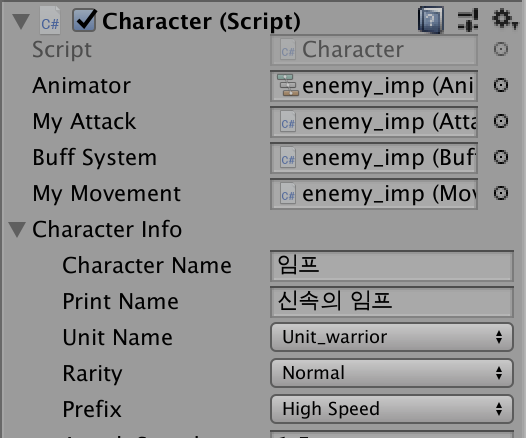

# 용병 랜덤 디팬스 

https://play.google.com/store/apps/details?id=com.TeamDot.RandomDefense&hl=ko 

직접 다운로드 해서 해볼 수 있습니다.

대햑교에서 창업동아리로 게임동아리를 만들어 진행한 프로젝트입니다.

랜덤한 유닛을 뽑아 거점을 지키며 초기 제작시 100단계로 한정에서 개발했습니다.

플레이스토어 출시 이후 유저들의 업데이트요청으로 무한모드를 추가하게 되었습니다. 

---

>창업동아리 프로젝트

제작 인원: 5명

>개요
게임 명 : 용병 랜덤 디펜스
개발 툴 : Unity, Visual Studio 2017
개발 언어 : C#
플랫폼 : android
Google PlayStore 서비스 유무 : 유

>제작 기간

2019.02 ~ 2019.06

>맡은 역할

퀘스트 시스템 
퀘스트 UI 
접두사 시스템
접두사에 따른 능력치 조절
스킬 
기본 맵 제작

---

> 퀘스트 시스템

QuestEventManager 

게임을 진행하면서 적군을 제거하는것만으로 돈을 버는것은 너무 모자르다 생각되어 추가되었습니다.
싱글톤을 이용해서 제작해서 필요한 퀘스트가 수행되면 QuestEventManager을 호출하여 퀘스트의 진행상황을 확인합니다.
퀘스트가 완료될경우 플레이어의 금화를 호출해 보상을 추가해줍니다.

> 퀘스트 UI

QuestInfoView 

진행중인 퀘스트의 진행도를 볼수있습니다. 미완료와 완료시의 나타나는 UI가 다릅니다.
리스트에 있는 퀘스트의 진행도를 시각적으로 표현합니다. 코루틴으로 퀘스트의 진행도가 변경되면 바로 반영되게 작성했습니다.
처음제작시 제대로 값을 불러오지 못했습니다. 리스트에 퀘스트들에대한 정보를 저장하고 UI에 하나씩 반복해서 출력하게 만들어 출력할수있게 만들었습니다.

QuestText

퀘스트가 완료될시 알림 UI에 퀘스트가 완료되었다는 알림과 얻는 금화를 유저에게 알려줍니다

>접두사 시스템

유닛들을 뽑을때 똑같은 유닛보다는 유닛마다 다른 스텟을 주고싶었고 그래서 추가된 기능입니다.
아군 적군 상관없이 추가 됩니다. 아군 유닛은 유닛을 뽑을떄 랜덤하게 배정됩니다.
오브젝트 풀링을 이용하고 있기 때문에 적군유닛이 새로 배치될 경우 다시 접두사를 지정합니다. 

 

접두사마다 컨셉에 맞는 추가적인 효과가 적용되며 버프뿐만 아니라 디버프도 있습니다.
접두사 마다 적용되는 능력치 변동은 RandomCharacterInfoCreator.cs에서 확인할 수 있습니다.

>스킬 

유닛의 등급에 따라 배정되어있는 스킬이 다릅니다. 모든 스킬에 대해서 유니티에서 출력되는 효과를 제작하고 스킬의 데미지 변수를 설정하고 조정했습니다
